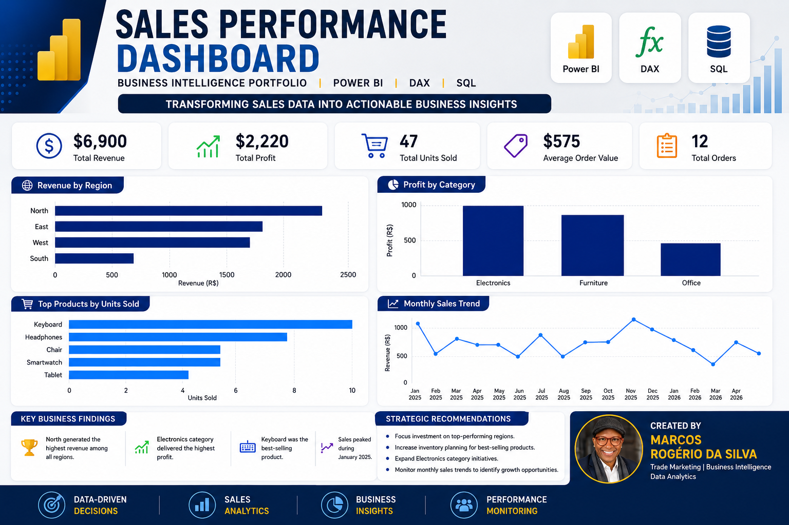
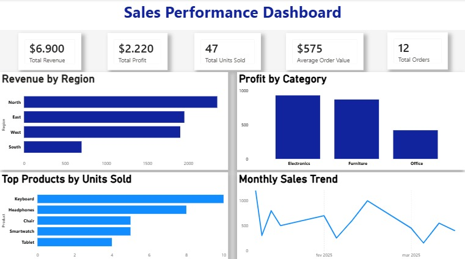

# 📊 Sales Performance Dashboard



## 📌 Project Overview

The Sales Performance Dashboard was developed to transform raw sales data into actionable business insights through interactive visualizations.

This project demonstrates how Business Intelligence tools can be used to monitor performance, identify trends, evaluate profitability, and support strategic decision-making.

---

## 🎯 Business Problem

Companies often struggle to consolidate sales information and quickly identify performance drivers across regions, products, and categories.

Without a centralized dashboard, decision-makers may miss important opportunities to improve profitability and optimize business performance.

---

## 💡 Business Solution

This Power BI dashboard provides a centralized view of key sales metrics, enabling users to:

- Monitor revenue and profit performance
- Analyze regional sales results
- Identify top-performing products
- Track sales trends over time
- Support data-driven decision-making

---

## ❓ Business Questions

The dashboard was designed to answer the following questions:

- What is the total revenue generated?
- What is the total profit achieved?
- Which region generates the highest revenue?
- Which category delivers the highest profit?
- What are the best-selling products?
- How are sales evolving over time?

---

## 📈 Dashboard Preview

### Project Dashboard



---

## 📊 Key Performance Indicators (KPIs)

| KPI | Value |
|------|------|
| Total Revenue | $6,900 |
| Total Profit | $2,220 |
| Total Units Sold | 47 |
| Average Order Value | $575 |
| Total Orders | 12 |

---

## 🔍 Key Business Insights

- North region generated the highest revenue.
- Electronics delivered the highest profit.
- Keyboard was the best-selling product.
- Sales peaked during January 2025.
- Revenue distribution highlights regional performance differences.

---

## 🚀 Strategic Recommendations

- Focus investments on top-performing regions.
- Increase inventory planning for best-selling products.
- Expand Electronics category initiatives.
- Monitor monthly sales trends to identify growth opportunities.
- Use performance insights to improve forecasting accuracy.

---

## 🛠️ Technologies Used

- Power BI
- DAX
- SQL
- Microsoft Excel
- Data Visualization
- Business Intelligence

---

## 📂 Repository Structure

```text
Sales-Performance-Dashboard
│
├── Dashboard
│   └── Sales_Performance_Dashboard.pbix
│
├── Data
│   └── sales_data.xlsx
│
├── Images
│   ├── banner.png
│   └── dashboard_preview.png
│
└── README.md
```

---

## 📚 What I Learned

Throughout this project, I improved my skills in:

- Data modeling
- DAX calculations
- Dashboard design
- Business storytelling
- KPI analysis
- Data visualization best practices
- GitHub project documentation

---

## 🔮 Future Improvements

- Add dynamic filters and slicers
- Integrate larger datasets
- Create additional dashboard pages
- Connect to real-world data sources
- Publish through Power BI Service

---

Marcos Rogério da Silva

Trade Marketing | Business Intelligence | Data Analytics

GitHub: https://github.com/marcosrdevbr 

LinkedIn: https://www.linkedin.com/in/marcos-rogerio-017923302/

Feel free to connect or share feedback about this project.

---

⭐ If you found this project interesting, feel free to connect with me and explore my portfolio.
